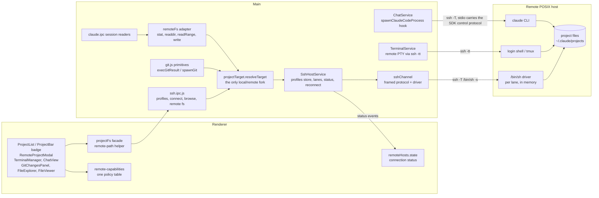
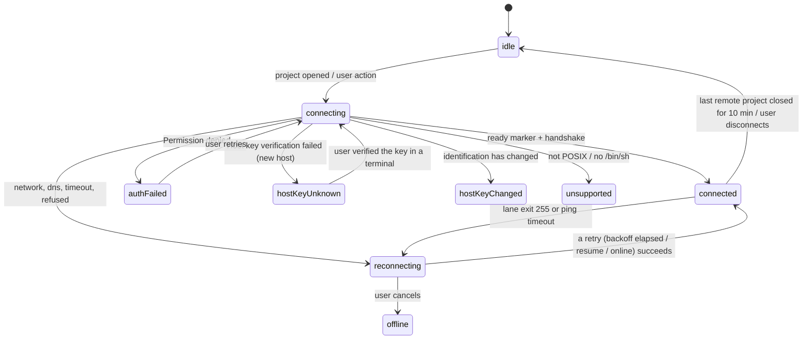

# Remote SSH projects

Status: design, accepted for implementation on `feat/remote-ssh`.
Issue: #224, "Remote development / execution support, IntelliJ Gateway-style".

This note decides how Claude Terminal opens a project that lives on another
machine and reaches it over SSH. The local app stays the UI; files, terminals,
git and the Claude Code CLI run on the remote host. It is written before the
code so the seven implementation slices at the end share one transport, one
data model and one rule for where a code path forks.

Everything below is additive. A local project must take exactly the code path
it takes today: every branch is `if (remote) { new code } else { untouched
code }`, and the local side of each fork is covered by the existing tests.

---

## 1. Goals and non-goals

**In scope**

- Saved SSH host profiles: host, user, port, identity file, ProxyJump, or an
  `~/.ssh/config` alias, plus agent forwarding (`-A`) as an opt-in.
- "Open Remote Project": choose a profile, browse the remote filesystem, pick a
  folder (or create one, `git init` it, or clone a repository into it).
- Remote execution of terminal tabs, quick actions, Claude chat sessions, git,
  and file browsing, viewing, editing and diffs.
- A visible host badge and connection status on the project and its tabs, and
  automatic reconnection after a transient network loss.
- Explicit, explained disabling of everything that cannot work remotely yet.

**Out of scope for this iteration**

- Any agent, daemon or binary installed on the remote host (section 9).
- Windows remote hosts. The remote side must be POSIX: Linux, macOS, the BSDs,
  WSL reached through its own sshd. A Windows sshd whose default shell is
  `cmd.exe` or PowerShell is detected at handshake and refused with a message.
- Storing passwords or passphrases anywhere.
- Copying files between a local tree and a remote one, or between two hosts.
- Project-type dashboards (FiveM, webapp, api, python, minecraft, discord)
  on remote projects: remote projects are `general` projects.

---

## 2. Transport

### 2.1 No pure-JS SSH library

There is no `ssh2`, `node-ssh`, `cpu-features`, `asn1` or `bcrypt-pbkdf` in
`node_modules`, and no new dependency may be added (the worktree's
`node_modules` is a junction to the main checkout, and the release pipeline
would have to ship and rebuild native helpers). The transport is therefore the
**system OpenSSH client**, which is a better answer anyway:

- it ships with Windows 10 1809+ (`%SystemRoot%\System32\OpenSSH\ssh.exe`,
  OpenSSH_for_Windows 9.5 on the reference machine), macOS and every Linux;
- `~/.ssh/config`, `Include`, `ProxyJump`, `ProxyCommand`, hardware keys,
  certificates, `ssh-agent` / Pageant-compatible agents and `known_hosts` all
  work exactly as they do in the user's own terminal;
- the app never sees a key or a password, so it stores no secret.

Binary discovery (main process only): on win32 `%SystemRoot%\System32\OpenSSH\ssh.exe`,
then `where.exe ssh` (Git for Windows ships one); elsewhere `/usr/bin/ssh`,
then `command -v ssh` through the existing `shell.js` PATH resolution. An
override path can be stored **in `remote-hosts.json`**, never in
`settings.json`: settings are cloud-synced and writable by the MCP
`settings_set` tool, so a binary path there would be a remote code execution
vector.

### 2.2 The Windows ControlMaster problem

On POSIX clients OpenSSH can multiplex every session over one TCP connection
(`ControlMaster`/`ControlPath`/`ControlPersist`), which makes "one `ssh` process
per git call" cheap. Win32-OpenSSH does not implement it (no Unix domain socket
passing). Spawning one `ssh` per call on Windows costs a full TCP + key exchange
+ auth round trip, typically 300 ms to 2 s, and the dashboard alone issues about
18 git commands (`getGitInfoFull`) while the file explorer polls status every
10 s. That is unusable.

Options considered:

| Option | Windows | Verdict |
|--------|---------|---------|
| One `ssh` per call | slow (handshake each time) | rejected as the main path |
| `ControlMaster` everywhere | not supported | rejected |
| `ControlMaster` on POSIX, per-call ssh on Windows | two code paths, Windows still slow | rejected as the main path |
| Batching calls into one ssh exec | helps fan-out, not latency of independent calls | used inside the channel, not instead of it |
| **Persistent command channel**: a long-lived `ssh -T host /bin/sh -s` speaking a framed request/response protocol on stdio | works, no OS feature needed | **chosen** |

**Decision.** Every request that is not interactive (git, fs, session history,
probes) goes through a **persistent command channel** per host profile. It is a
single `ssh` process per lane whose remote side is a POSIX `sh` running a small
driver script that the app sends over stdin when the channel opens. Requests and
responses are framed, so one TCP connection serves thousands of calls with one
round trip each and no handshake. It works identically on every client OS, so
there is one code path to test.

`ControlMaster` is kept as an **optional POSIX-client optimisation** for the
processes that cannot share the channel: terminal PTYs and chat CLI processes
each need their own `ssh` (a PTY cannot be multiplexed over a framed pipe).
On darwin/linux those spawns get `-o ControlMaster=auto -o
ControlPath=~/.claude-terminal/ssh/cm-%C -o ControlPersist=60` (directory
created `0700`), so a new terminal tab skips the handshake. On win32 they are
plain `ssh` spawns; a terminal tab paying one handshake when it opens is
acceptable, a git call paying one is not. The channel lanes carry the same
options on POSIX clients, which is what lets a lane ride on a master that a
password-authenticated terminal opened (section 5.1).

### 2.3 Channel protocol

The channel is spawned as:

```
ssh <profile flags> -T -o BatchMode=yes -o ServerAliveInterval=15
    -o ServerAliveCountMax=3 -- <destination> /bin/sh -s
```

The remote command is the literal `/bin/sh -s`: two tokens with no quoting, so
it parses identically whether the user's login shell is bash, zsh, dash, fish
or tcsh. The driver script is then written to stdin. POSIX requires a shell
reading its script from a non-seekable stdin to leave the file offset just after
the command it executed, which is what lets the driver's own `read` loop consume
the requests that follow on the same stdin.

**Driver (shipped in the app, sent per connection, never written to disk).**
In outline:

1. `umask 077`, create a private temp directory (`mktemp -d`, falling back to
   `${TMPDIR:-/tmp}/ct.$$` created with `mkdir -m 700`), `trap` its removal on
   `EXIT HUP INT TERM`.
2. Print `\nCT-READY-<nonce> <protocol version>\n`, where the nonce is 16 random
   bytes chosen by the client for this channel. Everything the remote side
   printed before it (a `.bashrc` that echoes, a `motd` some sshd configs send
   even without a PTY) is discarded by the client, which scans for that exact
   marker.
3. Loop on `read -r op id rest`:
   - `REQ <id>` followed by one line of script. Every script the app sends is
     built on one line (section 7.2 guarantees it), so the shell `read` builtin,
     the only reader POSIX guarantees not to over-consume a pipe, frames it.
     The script runs as `( eval "$script" ) >"$dir/o" 2>"$dir/e" </dev/null &`,
     the driver prints `PID <id> <pid>`, `wait`s, then prints
     `RES <id> <exit> <stdoutBytes> <stderrBytes>\n` followed by the raw bytes
     of both files. Lengths are computed with `$(( $(wc -c <file) ))`, which
     also strips the padding BSD `wc` adds. Output is binary safe because it is
     length-prefixed, not delimited.
   - `PUT <id> <bytes>` followed by base64 lines (64 characters, which
     `openssl base64 -d` needs) and a `.` terminator, read with the `read`
     builtin into a temp file and decoded with whichever of `base64 -d`,
     `base64 -D` or `openssl base64 -d` the driver found at startup. One script
     line follows the terminator and runs exactly like a `REQ`, with the
     decoded bytes on its stdin; a byte count that does not match fails the
     request (exit 95) instead of running it on truncated data. Used for small
     writes only (editor saves up to 256 KB). Larger transfers go through a
     one-shot exec (below), where stdin is exclusive and no framing is needed.
   - `PATH <id>` followed by one line: export it in the driver for every later
     request on that lane. This is how the login `PATH` the handshake captured
     reaches lanes opened after it.
   - `BYE`: exit cleanly.
4. The driver enables `set -m` when the shell supports it so each request runs in
   its own process group, which is what makes cancellation able to reach the
   `git` a request started and not just its subshell.
5. The whole driver is one `{ ... }` group, and the client sends nothing after
   it until the ready marker has arrived. POSIX requires a shell reading its
   script from a pipe not to read past the command it is executing, but older
   dash releases read stdin in blocks. With the group, the shell has parsed the
   entire driver before it prints the marker, so the only bytes such a shell
   can have buffered are the driver's own, and every request is read by the
   `read` builtin, which never over-reads.
6. The driver restores the user's umask for each request (its own `umask 077`
   protects its temp directory, not the user's files) and defines helpers the
   request scripts share: `ct_timeout`, and `ct_stat` / `ct_statL`, which pick
   GNU/busybox `stat -c` or BSD `stat -f` once at startup. Guessing per call
   would be wrong as well as slow: GNU reads `stat -f` as "file system status"
   and prints something else entirely.

**Handshake.** The first request on lane 0 collects, in one round trip:
`uname -s`, `$HOME`, `$SHELL`, the login shell's `PATH` (captured with
`"$SHELL" -l -c 'printf %s "$PATH"'` under a 5 s timeout, because `/bin/sh -s`
does not read the user's rc files and `claude` is usually in `~/.local/bin`),
`CLAUDE_CONFIG_DIR` from the same login shell, `git --version`, the resolved
`claude` path and `claude --version`, and whether `base64`, `inotifywait`,
`tmux` and `realpath` exist. The captured `PATH` is exported by the driver, so
git and later commands see the same environment the user's terminal does. The
result is cached per profile as the host's **capabilities**.

**Lanes.** A profile has a pool of up to three lanes, opened lazily. Each lane is
strictly FIFO, so a slow `git fetch` occupies one lane while status polls keep
flowing on another. Lane 0 opens at connect, runs the handshake and carries the
keepalive.

**Timeouts and cancellation.** Every request carries the timeout its local
equivalent has today (`execGitResult` 10 s, `spawnGit` 15 s, ...). On timeout or
abort the client sends `kill -TERM -- -<pgid>` on a sibling lane (opening one if
needed). If the request has not finished 2 s later the lane is closed; sshd then
hangs up the session and the remote process group receives `SIGHUP`. The caller
gets the same `{ ok:false, reason:'timeout'|'cancelled' }` it gets locally.

**Limits.** A response larger than the request's `maxBuffer` (default 1 MB, the
same as `execFile`) is read and discarded, and the request fails with
`reason:'maxbuffer'`. Scripts that may produce large output cap it themselves
with `head -c`.

**One-shot execs.** Three things bypass the channel and spawn their own `ssh`:
interactive PTYs (terminals), chat CLI processes, and bulk transfers or streams
(`git clone --progress`, downloading a 50 MB video for preview, uploading a file
over 256 KB). On POSIX clients these reuse the ControlMaster.

---

## 3. Data model

### 3.1 Host profiles: `~/.claude-terminal/remote-hosts.json`

Owned by the main process (`SshHostService`), never read or written by the
renderer directly, **not cloud-synced**, not reachable from any MCP tool, and
not part of `settings.json`.

```json
{
  "version": 1,
  "sshBinary": null,
  "profiles": [
    {
      "id": "h7k2m9qa",
      "label": "Build box",
      "sshConfigAlias": null,
      "host": "build.example.com",
      "user": "yanis",
      "port": 22,
      "identityFile": "C:\\Users\\Yanis\\.ssh\\id_ed25519",
      "proxyJump": "bastion.example.com",
      "forwardAgent": false,
      "tmuxSessions": false,
      "remoteClaudePath": null,
      "createdAt": 1790000000000,
      "lastConnectedAt": null
    }
  ]
}
```

Rules:

- Either `sshConfigAlias` is set (then `host`/`user`/`port` are optional and
  OpenSSH resolves the alias; `ssh -G <alias>` is run in main to display the
  effective `user@host:port`), or `host` is set.
- `id` is 8 characters of `[a-z0-9]`, generated by main. It is the only thing a
  project stores about its host.
- Validation, in main, before anything is saved or passed to `ssh`:
  `host`, `sshConfigAlias`: `^[A-Za-z0-9._:\[\]-]+$`, must not start with `-`;
  `user`: `^[A-Za-z0-9._][A-Za-z0-9._-]*$`;
  `port`: integer 1..65535;
  `proxyJump`: comma-separated `[user@]host[:port]` items with the same
  character rules, no item starting with `-`;
  `identityFile`: absolute local path, no control characters, must exist;
  `remoteClaudePath`: absolute POSIX path, no control characters.
  There is **no** free-form `-o` field. A profile carrying `ProxyCommand` or
  `LocalCommand` would be local code execution for anyone able to write the
  file; users who need those put them in their own `~/.ssh/config`, which is
  theirs to trust.
- Persistence follows the app rule: atomic write (temp + rename), `.bak`, and a
  parse failure **aborts** (`REMOTE_HOSTS_UNREADABLE`) instead of starting from
  an empty list. Absent file means no profiles.
- `~/.ssh` stays blocked to the renderer (`rendererSecurity.js`); the identity
  file picker is a main-process dialog that returns the chosen path only.

### 3.2 Remote projects in `projects.json`

```json
{
  "id": "p_...",
  "name": "api",
  "type": "general",
  "path": "ssh-remote://h7k2m9qa/home/yanis/api",
  "remote": {
    "profileId": "h7k2m9qa",
    "path": "/home/yanis/api",
    "hostLabel": "yanis@build.example.com"
  }
}
```

- **`path` is a URI**, `ssh-remote://<profileId><absolute POSIX path>`, not a
  bare POSIX path. This is the most important safety decision in the design:
  - on Windows `path.isAbsolute('/home/yanis/api')` is true and
    `path.resolve` turns it into `E:\home\yanis\api`; `rendererSecurity.install()`
    grants renderer read/write to every `project.path`, so a bare remote path
    would grant a local folder, and a remote `/` would grant the whole drive;
  - on Linux and macOS the same path may well exist locally (same user name),
    so every unported `fs`, `git`, `chokidar` or TODO-scan call would silently
    act on the wrong local folder.
  The URI is not absolute on either platform and does not exist on disk, so
  every code path not yet taught about remote projects **fails closed**:
  `grant()` ignores it, `permitted()` refuses it, `fs.existsSync` is false and
  `execGitResult` returns `reason:'nodir'`. An unported feature shows "not
  found", it never touches local data.
- `remote.path` is the canonical remote path (resolved once with `cd -P && pwd -P`
  when the project is created). `remote.hostLabel` is a display cache so a
  project synced to a machine that lacks the profile can still say where it
  lives.
- The URI is the project's identity. Dedupe is case-sensitive for URIs (the
  existing `normalize()` lowercases, which is right for Windows paths and wrong
  for POSIX ones).
- `type` stays the project-type plugin field and is forced to `general` for
  remote projects in this iteration. Remoteness is the separate `remote` field.
- The three-way merge in `projects.merge.js` treats `remote` as one field value,
  which is correct: its parts only make sense together.
- Cloud sync: `SyncEngine._mergeProjectsData` keeps the local `path` for a known
  project and copies a new one as-is. A remote project arriving from another
  machine references a profile that does not exist here; it is shown with the
  "host not configured on this machine" state and a button to create a profile
  with that id from its `hostLabel`. Nothing connects until the user does.

### 3.3 Paths in the renderer

The renderer's `path` is a synchronous IPC to main's `path` module, which is
`path.win32` on Windows and would turn `/home/yanis/api/src` into
`\home\yanis\api\src`. Remote paths are manipulated only through
`src/shared/remote-path.js`, a pure-JS POSIX implementation that understands the
URI: `isRemotePath`, `parse`, `format`, `join`, `dirname`, `basename`,
`extname`, `relative`, `normalize`, `isInside`. It refuses `..` escaping the
root and control characters.

---

## 4. Architecture



### 4.1 One host abstraction, thin call sites

The fork between local and remote happens at **primitives**, never scattered
through features:

| Primitive | Local (unchanged) | Remote |
|-----------|-------------------|--------|
| `projectTarget.resolveTarget(pathOrUri)` (main) | `{ kind:'local', path }` | `{ kind:'remote', profile, remotePath, host }` after checking the profile exists **and** the URI is inside a project registered in `projects.json` (or is a browse request, below) |
| `git.js` `execGitResult` / `spawnGit` | `execFile('git', ...)` | `git -C <remotePath> -c protocol.ext.allow=never ...` on a channel lane, same result contract |
| `TerminalService.create` | node-pty on PowerShell / `$SHELL` | node-pty on `ssh -tt` |
| `ChatService.startSession` | SDK local spawn | same SDK call plus `spawnClaudeCodeProcess` |
| `remoteFs` (main) | n/a (callers keep `fs`) | channel-backed `stat`, `readdir`, `readFile`, `readRange`, `writeFileAtomic`, `mkdir`, `rm`, `rename`, `copy`, `listFiles`, `grep` |
| claude.ipc session readers | `fs` | same parsers fed by `remoteFs` |
| renderer `projectFs(project)` | `window.electron_nodeModules.fs` | async `ssh.fs.*` IPC |
| renderer `remoteCapabilities.can(project, feature)` | always `{ ok:true }` | `{ ok:false, reasonKey }` for the disabled list |

Rules that keep this honest:

- Main **never** accepts a host, user, port or ssh argument from the renderer.
  Every IPC carries a `projectId` or an `ssh-remote://` URI; main resolves the
  profile itself. A compromised renderer can at most reach hosts the user has
  already configured, inside folders the user has already opened.
- The directory browser of the Open Remote Project flow is the one exception to
  "inside a registered project": it takes a `profileId` and a path, and may only
  list directories (names and types), create a directory, `git init` and
  `git clone` into a new directory. It cannot read file contents.
- The synchronous fs bridge (`renderer-fs-sync`) never serves a remote path: a
  `sendSync` that waits on the network would freeze the renderer. Remote fs is
  async only.
- Every direct `execFile('git', ...)` outside the two primitives (worktree
  create/remove/lock/unlock/prune, `countLinesOfCode`, `ParallelTaskService`
  branch delete) is folded into the primitives first, so routing cannot be
  missed by a call site that bypasses them.

### 4.2 Main-process modules

| Module | Role |
|--------|------|
| `src/shared/remote-path.js` | URI parse/format and POSIX path ops (section 3.3) |
| `src/shared/remote-shell.js` | Quoting (section 7.2), one-line script builders, ssh error classification from exit code + stderr |
| `src/shared/remote-capabilities.js` | The single policy table of what a remote project can do, with i18n reason keys. Used by renderer UI, main IPC guards, workflow nodes and MCP tools |
| `src/main/utils/sshCommand.js` | ssh binary discovery, argv builder from a profile (`-p`, `-i`, `-J`, `-A`, keepalives, BatchMode, ControlMaster on POSIX), always `--` before the destination |
| `src/main/utils/sshChannel.js` | One lane: spawn, ready-marker scan, frame parser, request queue, cancellation |
| `src/main/utils/sshDriver.js` | The driver script as a string constant, versioned with the app |
| `src/main/utils/projectTarget.js` | `resolveTarget`, the registered-project check, path containment |
| `src/main/utils/remoteFs.js` | fs operations as one-line scripts over a lane, with byte caps |
| `src/main/services/SshHostService.js` | Profile store, lane pools, capabilities cache, connection state machine, reconnect, status broadcast |
| `src/main/ipc/ssh.ipc.js` | Profiles CRUD, test, connect/disconnect, status, browse, remote fs, remote clone/init |

The preload namespace is `ssh`. The names avoid "remote", which in this
codebase already means the PWA (`remote.ipc.js`, `RemoteServer.js`) and
claude.ai Remote Control (`remote-control.ipc.js`).

---

## 5. Subsystems

### 5.1 Terminals and quick actions

`TerminalService.create` gains a remote branch selected by `projectId` (main
reads `project.remote`; the renderer sends nothing host-related):

- spawn the ssh binary in node-pty with `-tt`, the profile flags,
  `-o ServerAliveInterval=15 -o ServerAliveCountMax=3`, then `--`, the
  destination, and one remote command argument
  `/bin/sh -c <q("cd -- <q(cwd)> && exec \"${SHELL:-/bin/sh}\" -l")>`;
- a Claude tab runs `exec "${SHELL:-/bin/sh}" -l -c <q(claude args)>` instead, so
  the remote login `PATH` finds `claude`, with the same `resumeSessionId` regex,
  `--dangerously-skip-permissions` and `--rc` logic as today. The branch is on
  the remote OS (always POSIX), not on the local `process.platform`;
- with `tmuxSessions` enabled on the profile and `tmux` present, the shell is
  `tmux new-session -A -s ct-<tabKey>`, so a dropped connection reattaches to the
  same shell. Opt-in, because it changes how scrollback behaves;
- no local `existsSync` on the cwd, no `accountEnv` overlay (the remote host has
  its own `claude /login`);
- ConPTY and Unix PTY resizes already propagate to ssh as window-change events.

Exit code 255 from ssh means the connection or authentication failed, not that
the user typed `exit`. The terminal emits `terminal-disconnected` instead of
`terminal-exit`, the tab shows a "connection lost" overlay with the host state,
and when the host is reachable again it respawns: plain shells reopen in the
same cwd (state is lost unless tmux was on), Claude tabs respawn with
`--resume <claudeSessionId>`. The resume watchdog (20 s without output) is keyed
on "connected" for remote tabs, not on the first byte, since a ProxyJump
handshake can take that long by itself.

Quick actions create a terminal and type a command into it, so they follow the
terminal routing. `$HOME` is left literal for the remote shell to expand,
`$BRANCH` comes from remote git status, `$PROJECT_PATH` is `remote.path`.

Tab ownership comparisons (`termData.project.path === project.path`, about ten
sites) move to `project.id` where the project object is at hand, which is also
correct for local projects.

Password-only hosts: terminals work, because node-pty gives ssh a TTY and
OpenSSH prompts in the tab itself. Nothing is stored. The channel and chat run
with `BatchMode=yes` and therefore require key or agent authentication; on POSIX
clients a terminal that authenticated by password becomes the ControlMaster and
the channel reuses it. A future option is `SSH_ASKPASS` + `SSH_ASKPASS_REQUIRE=force`
pointing at an app helper that prompts in a modal and keeps nothing, but it is
not part of this iteration.

### 5.2 Claude chat

`ChatService.startSession` keeps calling `sdk.query()` with
`pathToClaudeCodeExecutable: getSdkCliPath()`. For a remote project it adds
`spawnClaudeCodeProcess` (SDK 0.3.260, `sdk.d.ts` `SpawnOptions` /
`SpawnedProcess`; a Node `ChildProcess` satisfies the interface):

- the hook ignores `options.command` (a local Windows path) and `options.cwd`,
  and spawns `ssh -T -o BatchMode=yes <profile flags> -- <dest> /bin/sh -c
  <q("cd -- <q(remotePath)> && exec env <allowlisted vars> <q(remoteClaude)> <q(args)...>")>`;
- because the binary is native, the SDK passes only flags in `args`, so the same
  argument list is valid for the remote `claude`;
- `cwd` given to `sdk.query()` is the local home directory, so any local check
  the SDK performs passes; the remote path is used only inside the hook;
- environment: an allowlist of variables the SDK sets for its child
  (`CLAUDE_CODE_ENTRYPOINT`, `CLAUDE_AGENT_SDK_VERSION`, and the effort/model
  related `CLAUDE_CODE_*` switches the app sets) is forwarded through `env`.
  Never `PATH`, `HOME`, `APPDATA`, `CLAUDE_SECURESTORAGE_CONFIG_DIR`,
  `CLAUDE_CONFIG_DIR`, `ANTHROPIC_API_KEY`, `CLAUDE_CODE_OAUTH_TOKEN` or anything
  credential-shaped: values on a remote command line are visible to every user
  of that host through `ps`, and the remote CLI must use the remote login;
- `child.stderr` is piped into `session._stderr` by the hook, because the SDK's
  `stderr` option is only wired by its own local spawn;
- the Claude in Chrome MCP server is not added (its command is a local binary
  path); the session shows a note;
- `ModelCatalogService.ingestInitResult` is skipped: a remote CLI's model list
  must not overwrite the local catalog cache keyed to the bundled binary;
- the account overlay and account binding do not apply.

Permissions, elicitations, interrupts, `setModel`, `setPermissionMode`, fork and
rewind travel over the SDK's stdio control protocol and work unchanged.
In-process SDK MCP servers (`createSdkMcpServer`, type `sdk`) also ride that
channel and are the future route for exposing the app's MCP tools to remote
sessions; the stdio `claude-terminal` server registered in the local
`~/.claude.json` is invisible to a remote CLI and is documented as unavailable.

**Remote CLI checks** use the handshake capabilities: `claude` not found
(remote exit 127, or nothing resolved) gives "Claude Code is not installed on
<host>" with the install command; a version older than the bundled
`getSdkCliVersion()` minor gives a warning (not a block) naming both versions.
`profile.remoteClaudePath` overrides resolution.

**Errors and reconnect.** `_humanizeError` gains the ssh cases, classified by
`remote-shell.classifySshFailure(exitCode, stderr)`: `auth` ("Permission
denied"), `hostkey-unknown` ("Host key verification failed" for a new host),
`hostkey-changed` ("REMOTE HOST IDENTIFICATION HAS CHANGED"), `dns`
("Could not resolve hostname"), `timeout`, `refused`, `network` (connection
closed or reset, broken pipe), `not-installed` (127). A `network` failure
mid-session emits `chat-error` with `errorType: 'connection_lost'`; ChatView
shows a reconnect banner and, when the host is back, restarts the session with
`resume: <CLI session id>` through the existing resume path.

### 5.3 Session history

Transcripts of a remote session live in the remote
`${CLAUDE_CONFIG_DIR:-$HOME/.claude}/projects/<encodeProjectPath(remote.path)>/`.
`encodeProjectPath` in `src/shared/session-dirs.js` is the CLI's own encoding
and applies unchanged to POSIX paths.

Decision: **read it over the channel**, do not degrade to "unavailable" when
connected, and do not use the SDK's `sessionStore` mirroring (it is `@alpha`, and
the SDK documents that mirror frames are dropped unless the subprocess
`CLAUDE_CONFIG_DIR` matches the parent's exactly, which a remote host never
does).

- `claude.ipc.js` readers are refactored onto a small fs interface
  (`stat`, `readdir`, `readRange(file, start, length)`, `readLines`). The local
  implementation is a thin wrapper over the current `fs` calls; the remote one is
  `remoteFs`. Parsers are unchanged.
- Session listing is one request: a script that prints, for every `*.jsonl` in
  the directory, its size, mtime and first N lines, capped. Cached by
  `(profileId, remote.path, directory mtime)`.
- History loading stays tail-first: `readRange` on the end of the file
  (`tail -c` / `dd skip=`), so a 50 MB transcript costs only the tail.
- Delete runs `rm --` remotely. Export reads remotely and writes locally.
  Move-session, orphaned worktree discovery and workflow session cleanup are
  disabled for remote projects.
- While disconnected, the sessions modal, Files session picker and Timeline show
  "History lives on <host>, not connected" rather than an empty list.

### 5.4 Git

The two primitives in `src/main/utils/git.js` route on `isRemotePath(cwd)`
before the existing `fs.existsSync(cwd)` bail-out:

- remote command: `cd -- <q(remotePath)> && GIT_TERMINAL_PROMPT=0 exec git
  -c protocol.ext.allow=never <q(args)...>`; `safeDirArgs` is skipped (it is a
  local Windows ownership workaround that reads `.git` with `fs`);
- a failed `cd` maps to `reason:'nodir'`, exit 127 to `'enoent'`, the transport
  being down to a new `'disconnected'` reason; the `{ ok, output, reason, error }`
  and `{ success, output, error, reason }` contracts are otherwise unchanged;
- requests are registered so `killAllGitProcesses` at quit cancels them and
  closes the lanes;
- a 2 s TTL cache keyed on `(profileId, remotePath, args)` covers read-only
  commands used by polling (`status`, `rev-parse`, `branch`), invalidated by any
  write command on the same repository.

Local-fs helpers become pure git, which then serves both kinds identically:
`isMergeInProgress` via `git rev-parse -q --verify MERGE_HEAD`,
`isRebaseInProgress` via `git rev-parse --git-path rebase-merge` plus a stat,
`detectWorktree` via `rev-parse --path-format=absolute`, and the untracked part
of `gitDiscardFiles` via `git clean -f -d -- <paths>`. These replacements apply
to remote targets only; the local implementations stay as they are, to honour
"local behaviour unchanged".

Specific handlers:

- `git-clone` for remote: `git clone --progress -- <url> <remotePath>` as a
  one-shot exec streaming progress. The local GitHub token is **not** shipped to
  the remote command line (visible in `ps`); the remote host's own credentials
  or a forwarded agent are used. The URL allowlist (`https://`, `git@host:`)
  applies.
- Commit message generation reads untracked file heads with one batched remote
  request instead of local `stat`/`readFile`.
- `project-stats` runs one remote command
  (`git ls-files -z | ... | xargs -0 wc -l`, `find` fallback), cached.
- `scan-todos` runs `git grep -n -I -E '<pattern>'` (fallback `grep -rnI`) and
  classifies lines locally with the existing regexes.
- Worktree paths returned by git are re-wrapped as URIs and never `grant()`ed.
- Pull/push run with the remote host's credentials.
- GitHub API calls (PRs, CI pill) stay local; they only need the remote URL.
- Startup git sweep skips remote projects and fills them in when their host
  connects, so a dead host never slows startup.

### 5.5 Files

- New async IPC `ssh.fs` (`stat`, `readdir` returning name/type/size/mtime in one
  round trip, `readFile` with a byte cap or base64, `writeFile` atomic via temp +
  `mv`, `mkdir -p`, `rm -rf --`, `mv --`, `cp -a --`, `listFiles`, `grep`).
  Main re-checks containment: the target, after POSIX normalisation and, for
  writes, after canonicalising the parent with `cd -P && pwd -P`, must be inside
  the project's canonical root. Remote writes to `~/.ssh`, shell rc files and
  `~/.claude/.credentials.json` are refused even inside a project, mirroring the
  local blocklist; reads of `~/.claude/.credentials.json` and `~/.ssh` are
  refused. The project's private memory directory under the remote
  `~/.claude/projects/<encoded>/` is the one grant outside the project root.
- Renderer `projectFs(project)` returns the local bridge for local projects and
  the `ssh.fs` facade for remote ones. `FileExplorer` receives per-root fs and
  path backends; node identity stays the URI, so `data-path`, selection, git
  badges and `revealPaths` keep working.
- Watching: chokidar and `fs.watch` cannot watch a remote path. For remote roots
  `explorer.ipc.js` runs a poller: every 4 s, only while Files is visible and the
  window focused, one batched request lists every expanded remote directory,
  main diffs against the previous snapshot and emits the existing
  `explorer:changes` events, so FileExplorer itself does not change. When the
  handshake found `inotifywait`, a one-shot `inotifywait -m` exec replaces the
  poll. Polling stops on disconnect and resyncs after reconnect. A markdown tab's
  live reload polls the remote stat every 3 s.
- Search: name search uses `git ls-files -co --exclude-standard` (fallback
  `find`), content search `git grep -n -I -i --max-count=3 -F` (fallback
  `grep -rnIi -m3`), capped. Never one call per file.
- Media: the CSP allows `blob:`/`data:` for images only (`img-src`), and
  `media-src` / `connect-src` would need relaxing for blobs, which is not done.
  Images, video, audio, PDF and 3D models are downloaded (one-shot exec, size
  capped) to `~/.claude-terminal/remote-cache/<projectId>/` and shown through the
  existing `file://` code paths. The cache is pruned by size and age.
- Open in editor: for `code`, `cursor` and `windsurf` the app launches
  `<editor> --remote ssh-remote+<alias or user@host> <remotePath>` (VS Code
  Remote-SSH reads the same `~/.ssh/config`). Other editors: disabled with a
  tooltip. Open in Explorer: disabled.
- Copy, move or drag between a local root and a remote root: refused with a
  toast in this iteration.
- `MemoryEditor`: the project `CLAUDE.md` is `<remote.path>/CLAUDE.md`; the CLI's
  private memory is in the remote `~/.claude/projects/<encoded>/`.
- The dashboard's disk cache for a remote project is kept locally under
  `remote-cache/<projectId>/dashboard.json`; the app never writes its own files
  into a remote repository.

---

## 6. Connection lifecycle and reconnect

Per profile, `SshHostService` runs a state machine broadcast to every window as
`ssh-status-changed { profileId, state, detail, retryAt, capabilities }`:



- Connections are lazy: nothing connects at startup. A host connects when one of
  its projects is opened, a tab of it is restored, or the user clicks connect.
- Liveness: `ServerAliveInterval=15`, `ServerAliveCountMax=3` on every ssh
  process, plus an app-level ping (`:`) on lane 0 every 20 s with a 10 s timeout.
- Backoff: 1, 2, 4, 8, 16, then 30 s, for as long as a project of that host is
  open. Retries stay in `reconnecting` (with `detail.attempt` and `retryAt`)
  rather than passing through `connecting` on each attempt, so the badge does
  not flicker between two states every few seconds; `connecting` is only the
  first attempt after `idle`, or after the user retries a stopped state. An immediate attempt on `powerMonitor` `resume` and on the renderer's
  `online` event.
- **No automatic retry** on `authFailed`, `hostKeyUnknown`, `hostKeyChanged` or
  `unsupported`: retrying an auth failure can lock an account (fail2ban,
  `MaxAuthTries`), and a host key problem needs a human.
- Requests issued while reconnecting: idempotent reads (`git status`, `stat`,
  `readdir`, history) wait for the connection within their own timeout; writes
  (`commit`, `writeFile`, `rm`, `push`) fail fast with `reason:'disconnected'`
  and are never replayed.
- Terminals and chat reconnect as described in 5.1 and 5.2.
- UI: a host badge (label + coloured dot from CSS variables) on the project in
  ProjectList and ProjectBar, on each tab and in the ChatView header; tooltip
  with state, detail and next retry time; the Git panel shows a
  "reconnecting to <host>" banner instead of "Not a git repository".

---

## 7. Security

### 7.1 Trust boundaries

- **Host keys.** `StrictHostKeyChecking` is never set to `no` and
  `UserKnownHostsFile` is never redirected. Under `BatchMode=yes` an unknown host
  fails; the UI offers "Verify host", which opens a local terminal tab running
  `ssh -o StrictHostKeyChecking=ask -- <dest> exit` so OpenSSH itself shows the
  fingerprint and writes `known_hosts`. A changed key gets a blocking warning and
  no shortcut.
- **Renderer cannot choose a destination** (4.1). Every IPC resolves the profile
  from `projectId` or the URI's profile id, then checks containment.
- **`rendererSecurity.install()` skips remote projects explicitly**
  (`if (project.remote) continue`), in addition to the URI failing `isAbsolute`.
  A test asserts that a remote project yields no grant on either platform.
- **Profiles are not synced and not MCP-writable**; there is no free-form ssh
  option; the ssh binary override lives in the same unsynced file.
- **Agent forwarding** is off by default and labelled: root on the remote host
  can use the forwarded agent while the session is open.
- **Secrets on remote command lines**: none. No token, key or credential is ever
  put in argv or `env` on the remote side.
- **Remote fs blocklist** mirrors the local one (5.5).
- **Remote clone** uses the URL allowlist and no local token.

### 7.2 Command construction

Every remote command is built from argv arrays by `remote-shell.js`; no user
path, branch name, file name or message is ever concatenated into a command
string.

- `q(value)`: rejects any control character (including newline and NUL), wraps
  the value in single quotes, and writes every `'` as `'\''` and every `\` as
  `'\\'`, that is, both outside the quotes. This form is parsed identically by
  POSIX sh, bash, zsh, dash, ksh, **fish** (where a backslash inside single
  quotes is special) and **csh/tcsh** (where a newline inside quotes is not
  allowed). It is used for every level of nesting.
- Scripts are single lines (`;` and `&&`), which the channel framing and csh both
  require.
- The ssh-side remote command for PTYs and chat is a single argv element
  `/bin/sh -c <q(script)>`, so the user's login shell only ever has to parse a
  path and one quoted word; the inner script is always run by `/bin/sh`.
  Login shells outside the sh/fish/csh families (nushell, xonsh, PowerShell) are
  detected at handshake and reported as unsupported.
- `--` precedes the destination in every ssh argv; a destination or jump host
  starting with `-` is rejected at validation and again at argv build time.
- `--` precedes paths in every remote `cd`, `rm`, `mv`, `cp`, `mkdir` and git
  pathspec list.
- Windows argv: node-pty and `child_process.spawn` both take an argv array and
  produce the CRT command line; tests round-trip paths containing spaces, `'`,
  `"`, `\`, `$`, backticks, `*` and non-ASCII through the builder.

---

## 8. Disabled for remote projects, and why

Each entry is a row of `src/shared/remote-capabilities.js`, so the UI greys the
control and shows the reason as a tooltip, main-side IPC refuses with the same
reason, and nothing fails silently.

| Feature | Why | What the user sees |
|---------|-----|--------------------|
| Project-type dashboards and run panels (FiveM, webapp, api, python, minecraft, discord) | Their services spawn local processes and read local files | Remote projects are created as `general`; type panels hidden; run dev servers from a remote terminal or quick action |
| Parallel tasks and the `parallel_spawn` node | Creates local worktrees and local agents | Disabled with tooltip |
| Workflow nodes bound to a remote project (`shell`, `git`, `file`, `claude`, `terminal`, `quickaction`, `session_recap`) and `file_change` / `git_event` triggers | Execute and watch locally; `claude.node` would silently fall back to `~` | Hidden in the cwd/project pickers; nodes throw "remote projects are not supported by workflow nodes yet" |
| Local MCP tools and Claude in Chrome in remote chats | Registered in the local `~/.claude.json` / point at local binaries | Note in the chat header; future path is in-process SDK MCP servers |
| Hooks event server for remote terminal tabs | The remote CLI never runs the local hook handler; tunnelling would mean editing the remote `~/.claude/settings.json` | Remote terminal tabs use the scraping provider |
| Account binding | The remote host has its own `claude /login` | Account picker disabled with tooltip |
| Cloud zip upload | Zips a local folder | Disabled; the git-based upload works |
| Open in Explorer; Open in editor (except VS Code family over Remote-SSH) | Local OS integrations | Disabled with tooltip |
| Session move, orphan worktree discovery, workflow session cleanup | Local transcript moves | Disabled |
| Path attachments in chat | A local path means nothing to the remote CLI | Inline within limits, otherwise refused with a toast |
| `@errors`, `@selection` mentions | Local-only sources | Filtered by the existing `LOCAL_ONLY_MENTIONS`, keyed on `isCloud || remote` |
| Copy/drag between local and remote trees | Needs a transfer feature | Refused with a toast |
| Overview multi-root mixing local and remote | A dead host would stall the tree | Remote roots shown collapsed with a connect affordance |
| Project-scoped MCP config panel, remote SQLite | Read local files | Skipped, with a note |
| MCP `project_info`, `project_todos`, `project_create` on remote | The MCP server reads local disk | Answer "remote project on <host>, not readable from the MCP server"; create refuses |

Unaffected: time tracking (keyed by project id), Kanban storage, Workspace,
Artifacts, Knowledge, network database drivers, tab naming, prompt enhancement,
recap generation, the model catalog for local sessions.

---

## 9. Why no remote agent or daemon

IntelliJ Gateway and VS Code Remote-SSH install a server on the remote host. We
do not, deliberately:

- **It is a second product.** A server has its own release train, protocol
  versioning and compatibility matrix with every app version still in the wild,
  plus binaries per OS, architecture and libc (glibc vs musl, old glibc on
  enterprise distributions, arm64, macOS, BSD).
- **It is a second attack surface.** A long-lived process holding a socket or
  port on a shared host must authenticate its client, survive users we do not
  know about, and be patched. SSH already does all of that, audited.
- **Many hosts forbid it**: read-only or quota-limited home directories,
  noexec `/tmp`, policies against unmanaged binaries.
- **It goes stale**: VS Code's `~/.vscode-server` accumulating one server per
  release is a known nuisance.

What we use instead is a POSIX `sh` driver sent over stdin with each connection.
It is never written to disk, lives exactly as long as the ssh session, is
versioned with the app (so client and "server" can never disagree), and needs
nothing beyond `/bin/sh` and the usual coreutils. The cost is accepted: no push
notifications for file changes (a poll, or `inotifywait` when present), and one
process spawn per request on the remote side, which is cheap next to a network
round trip.

---

## 10. Testing strategy

No sshd runs in CI and the unit suite must stay hermetic, so ssh is mocked at
three levels.

1. **Pure units** (`tests/shared/`, `tests/utils/`): `remote-path` (parse,
   format, join, relative, `..` refusal, control characters), `remote-shell`
   (`q()` round trip, executed for real through `/bin/sh -c` and, when present,
   `fish -c` and `tcsh -c`; skipped where the shell is absent), ssh argv builder
   (BatchMode present for channel and chat, `--` before destination, no
   `StrictHostKeyChecking=no` ever, ControlMaster only on non-win32, `-A` only
   when enabled, `-` destinations rejected), ssh failure classification from
   recorded stderr samples, profile validation, and the store's
   unreadable-file abort.
2. **Channel against a real `sh`** (`tests/utils/sshChannel.test.js`): the lane
   is constructed with an injected `sshBinary`; the test points it at
   `tests/helpers/fake-ssh.js`, a Node script that ignores the ssh arguments and
   execs the local `/bin/sh -s` (Git for Windows' `sh.exe` on Windows runners,
   skipped if missing). This runs the shipped driver for real: ready marker
   after noisy rc output, binary-safe responses, NUL bytes, large outputs over
   `maxBuffer`, concurrent lanes, timeout and process-group cancellation, `PUT`
   decoding. A separate pure-JS test feeds the frame parser random chunk splits.
3. **Service level with a scripted fake** (`tests/services/`): `fake-ssh.js`
   modes selected by an env var make it exit 255 with "Connection timed out",
   print "Permission denied (publickey)", or die mid-request. Jest fake timers
   assert the backoff schedule, that auth and host key failures are not retried,
   the status broadcast sequence, and that writes fail fast while reads wait.
   - `TerminalService`: node-pty mocked; a remote create spawns the ssh binary
     with the expected argv, skips `existsSync` and `accountEnv`; exit 255 emits
     `terminal-disconnected`; local create argv is byte-identical to today.
   - `ChatService`: SDK mocked; `spawnClaudeCodeProcess` present only for remote
     projects; env allowlist (no token, no PATH); Chrome MCP absent;
     `ingestInitResult` not called; stderr piped; the local options object is
     deep-equal to today's.
   - `git.js`: a URI routes to the remote executor mock with the quoted script;
     local paths keep the existing tests green unchanged.
   - `claude.ipc` readers over an in-memory fs adapter loaded from the existing
     jsonl fixtures, local and remote producing identical results.
   - `rendererSecurity`: a remote project yields no grant; `permitted()` refuses
     its URI.
   - Renderer: projects state dedupe for URIs, `checkMissingPaths` skipping
     remote, capability table driving disabled controls and tooltips, FileExplorer
     with a remote backend mock.
4. **Manual checklist** (in the last slice's PR description): Windows client to a
   Linux host with agent auth, ProxyJump, a password-only host in a terminal,
   unknown and changed host keys, Wi-Fi drop and resume from sleep, a host
   without `claude`, a fish login shell.

The Playwright smoke test stays as it is: it never configures a host, so it
guards that the new UI renders and that nothing connects at startup.

---

## 11. Implementation slices

Each slice is one commit (or a short series), leaves the app working with
`npm test`, `npm run lint` and `npm run check:docs` green, and keeps local
projects on their current code paths. Every slice that adds a file under a
counted directory, an IPC handler, an i18n key or a test file updates the
matching number and table in `CLAUDE.md` in the same commit.

1. **SSH transport, host profiles and IPC.** Shared path and quoting helpers,
   ssh argv builder, driver and channel, `SshHostService` with the state machine
   and reconnect, `remoteFs`, `projectTarget`, `ssh.ipc.js` and the preload
   `ssh` namespace. No UI.
2. **Remote project model, Open Remote Project, status badges.** Projects state,
   the modal with profile editor and directory browser, host badge and status,
   capability table, `rendererSecurity` skip, startup sweeps skipping remote
   projects, MCP project tools answering for remote projects.
3. **Terminals and quick actions over ssh**, with reconnect and optional tmux.
4. **Claude chat via `spawnClaudeCodeProcess` and remote session history.**
5. **Git over ssh**, including the Git panel, dashboard git sections, stats and
   TODO scan.
6. **Files**: explorer, viewer, file tabs, editing, watching, search, media
   cache, Memory editor, chat file mentions, VS Code Remote-SSH.
7. **Disabled features, i18n polish and documentation**: every row of section 8
   wired to the capability table, README sections in the six locales, CLAUDE.md.
